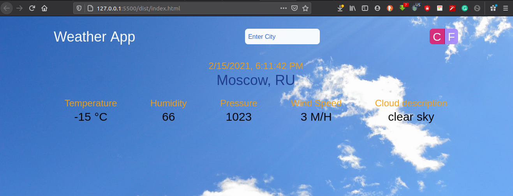

# Weather-app

> With this project, the open weather map API is used to fetch the weather data from around the world basing on the user input. City names are used to fetch data for that particular city.

## Built

- Javascript
- HTML 5
- TailwindCSS

## Live Demo

[Live Demo](https://rawcdn.githack.com/mke2111/Weather-app/1053e34bf766a7758d77d2c144ebf155baff387e/dist/index.html)

## Getting Started

To get a local copy up and running follow these simple example steps.

### Prerequisites

- A browser
- Text Editor

### Setup

**STEP 1**
In the terminal, Run the following commands.

- `git clone https://github.com/mke2111/Weather-app.git`
- `cd Weather-app`

OR

- Download the zip file form `https://github.com/mke2111/Weather-app/tree/develop`

**STEP 2**

- Run `npm install` to download all dependencies for the project.

**STEP 3**

-Run `npx webpack --watch` to compile all the Js code.

**STEP 4**

- Then open the `index.html` file using a browser.
- Enjoy the simple Weather app.

## Author

👤 **Roy Mukuye**

- GitHub: [@mke2111](https://github.com/mke2111)
- Twitter: [@Roymkenya](https://twitter.com/Roymkenya)
- LinkedIn: [Roy Mukuye](https://www.linkedin.com/in/roy-mukuye-42b07b1b4)

## 🤝 Contributing

Contributions, issues and feature requests are welcome!

Feel free to check the [issues page](https://github.com/mke2111/Weather-app/issues).

## Show your support

Give a ⭐️ if you like this project!

## 📝 License

This project is [MIT](https://opensource.org/licenses/MIT) licensed.